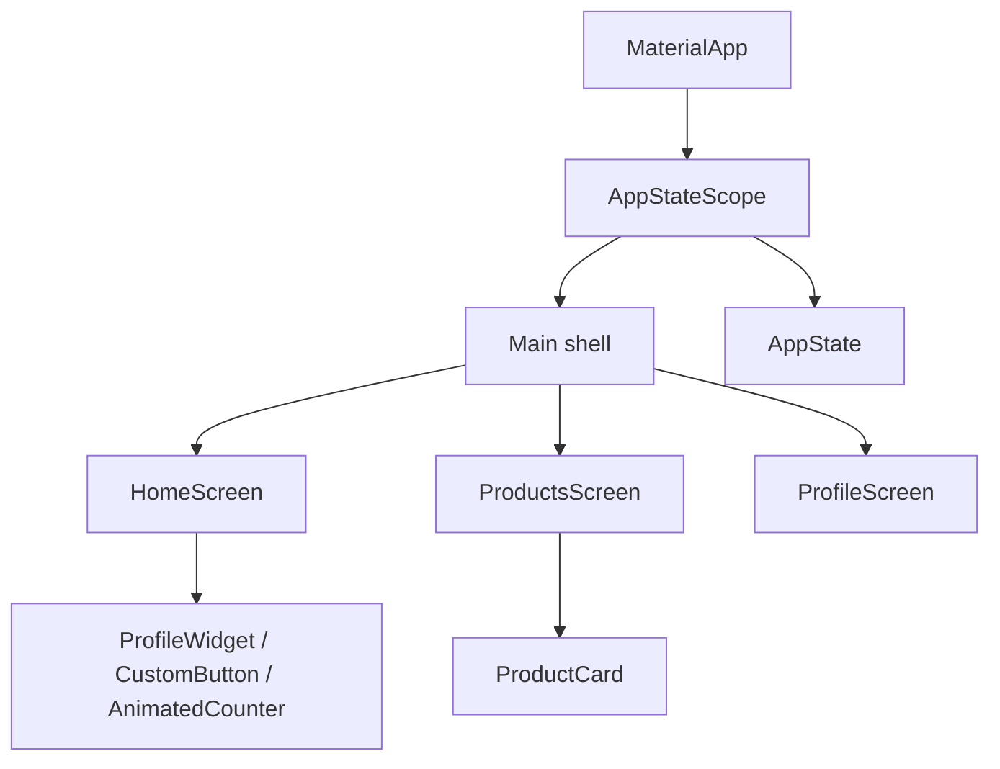
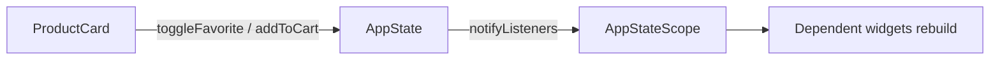

# Architecture

## State flow

## Mock API contract

- `Product`: `id`, `name`, `description`, `price`, `category`.
- `User`: `id`, `name`, `email`, `subtitle`.
- Дані локальні, мережевий API не використовується.
